# Feedmail

WebApp wrote in node js and vanilla js for sending rss via email

1. Tworzymy usługę App Service i konfigurujemy jej wdrożenie przy użyciu actions Github.
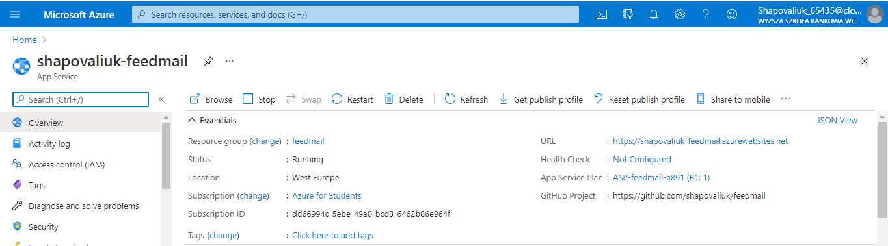
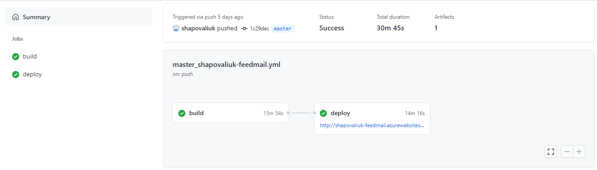

Tutaj znajdziemy url adres naszej strony
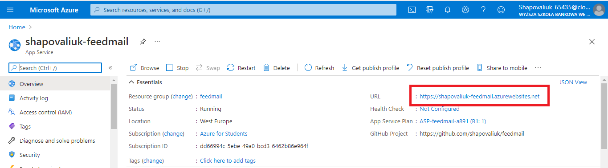

3. Tworzymy CosmosDb z mongo client API w naszym przypadku w wersji 3.6
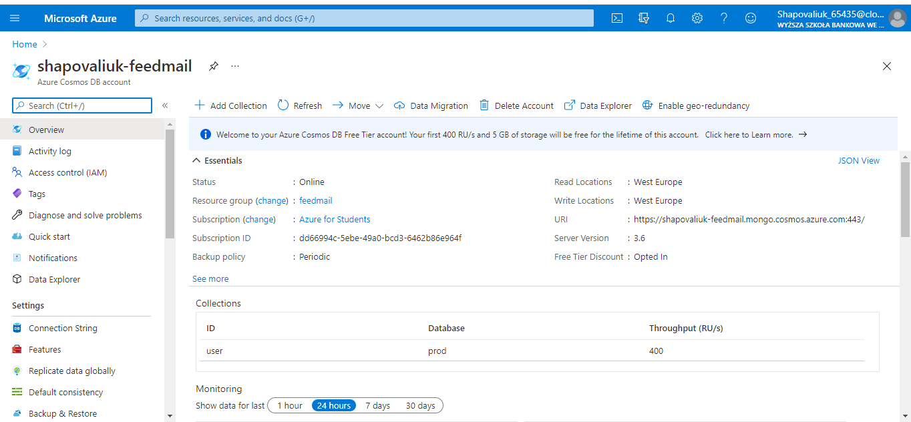

4. Wchodzimy do actions w repozytorium i naciskamy New Workflow
 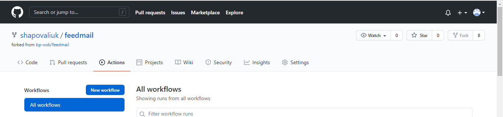
 
 Wybieramy Deploy Node.js to Azure Web App
 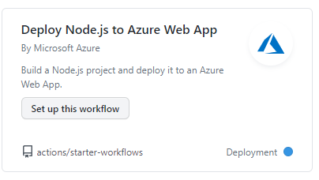
 
 I u nas się pojawia plik *azure.yml*
 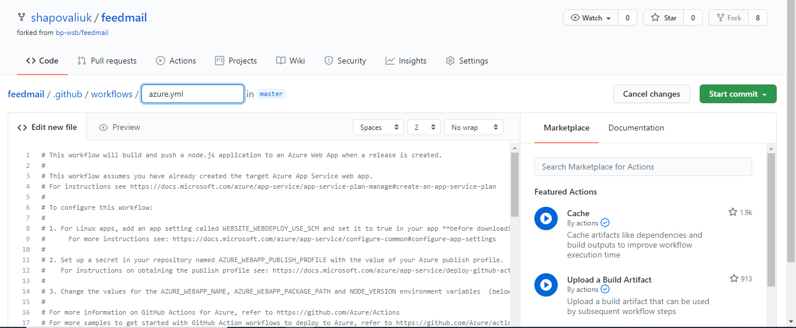

5. Wchodzimy do ustawien App Service i dodajemy zmienne środowiskowe w *Application settings*
- NODE_ENV z wartością production
- NODE_CONFIG z wartością :

      {
          "feedmail": {
              "db": {
                  "url": "", 
                  "name": "prod", 
                  "options": {
                  "useUnifiedTopology": true 
                  }
              },
              "logger": {
                  "level": "debug",
                  "filename": "./backend.log"
              },
              "mailgun": {
                  "domain": "",
                  "apiKey": ""
              }  
          }
      }
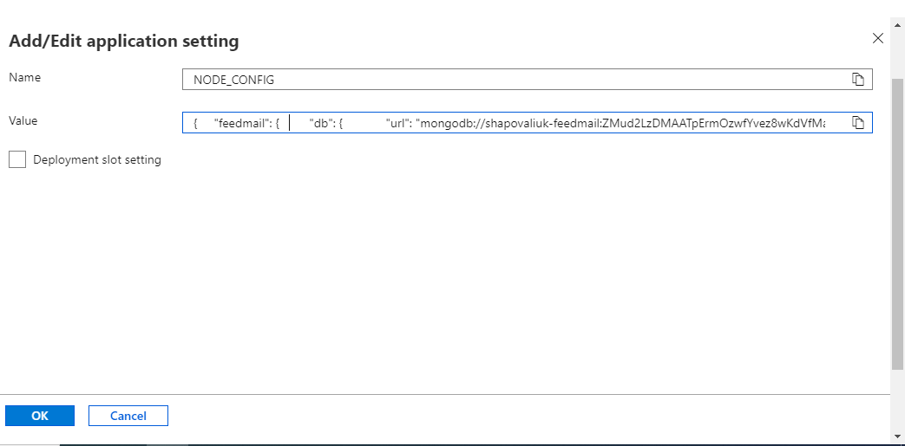
**Remark**

- url - skopiowaliśmy i wkleiliśmy parametry połączenia nowo utworzonego CosmosDb. Parametry połączenia są widoczne w sekcji Konfiguracja w CosmosDb.
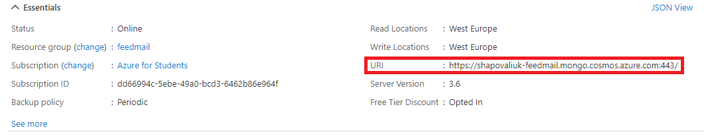

- apiKey - założyliśmy konto w portalu mailgun. Klucz API jest dostępnyz po zalogowaniu się do portalu mailgun.
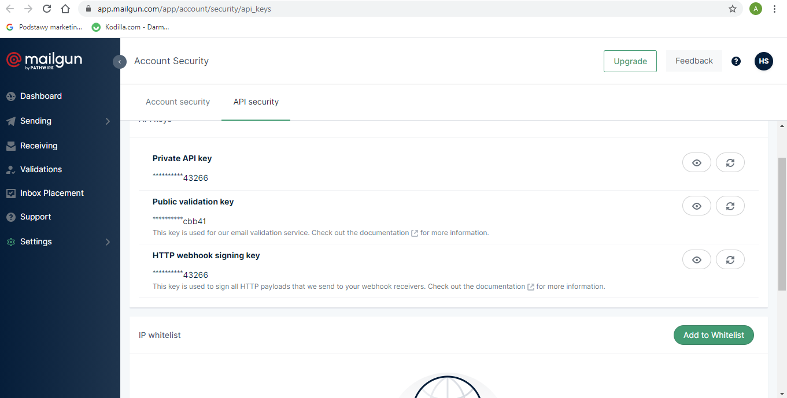

- domain - użyliśmy domeny utworzonej na stronie mailgun.
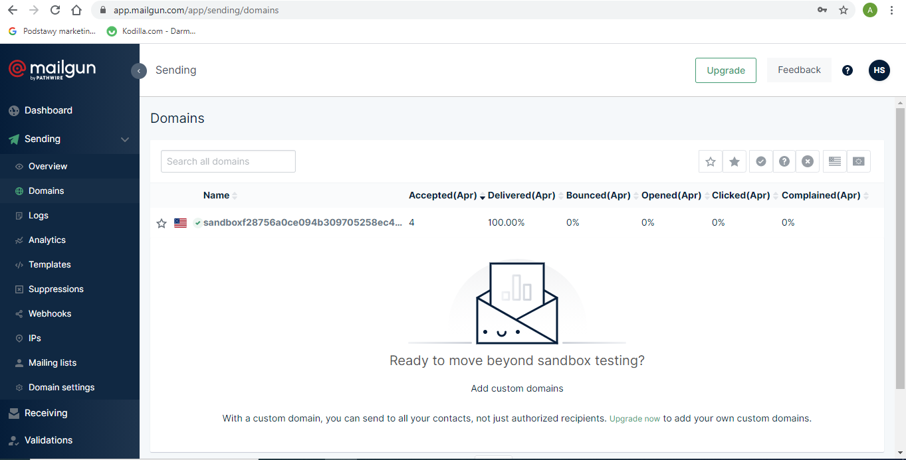

# Testy

*LoadPage*
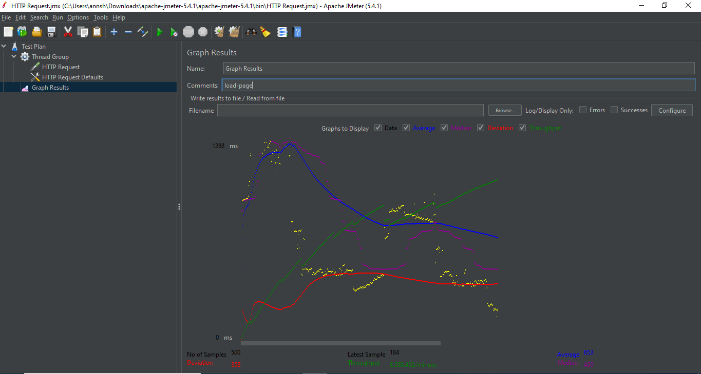

*GetUser*
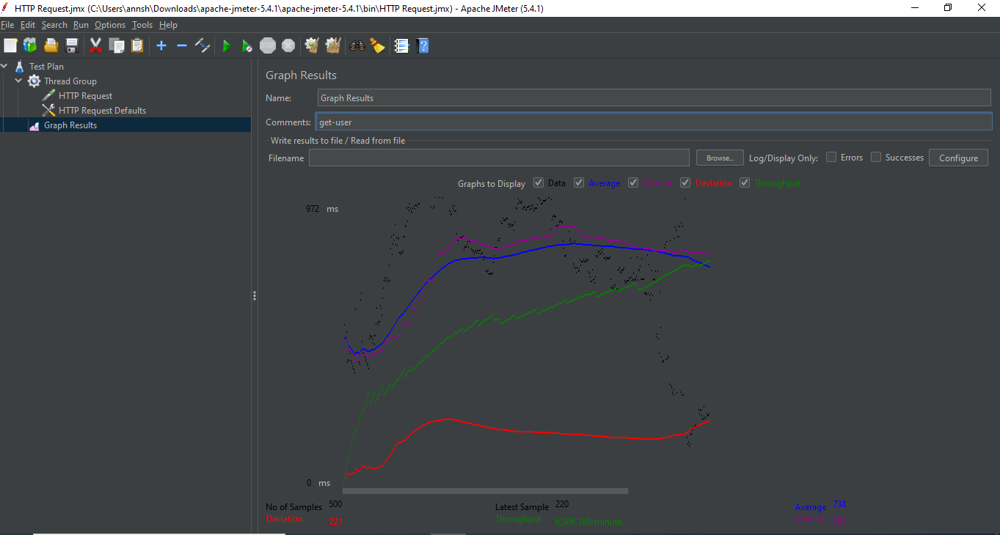
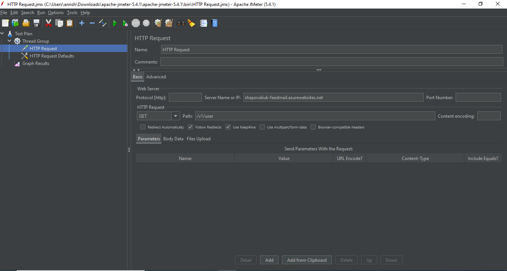

*PostUser*
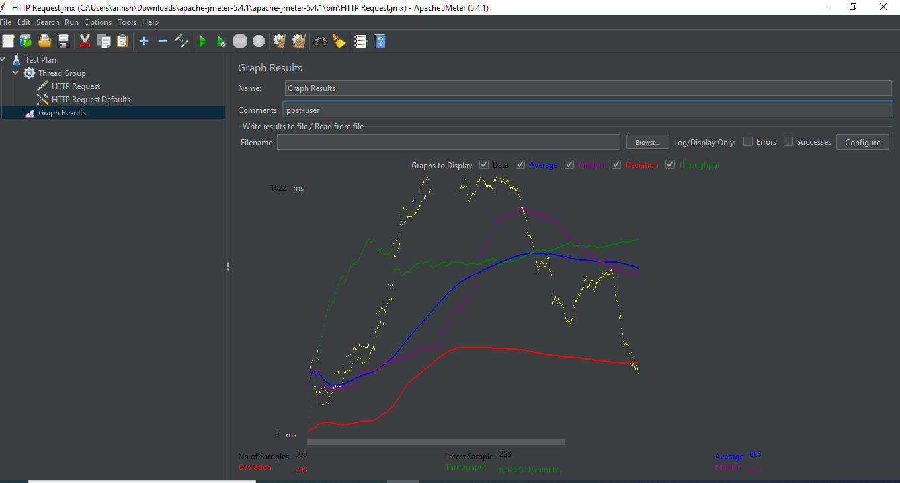

*GetMail*
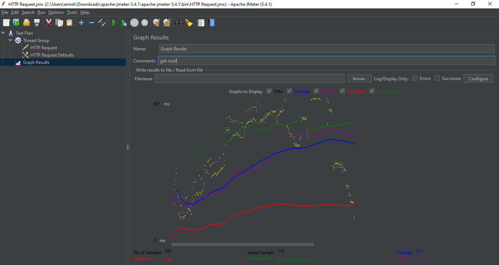
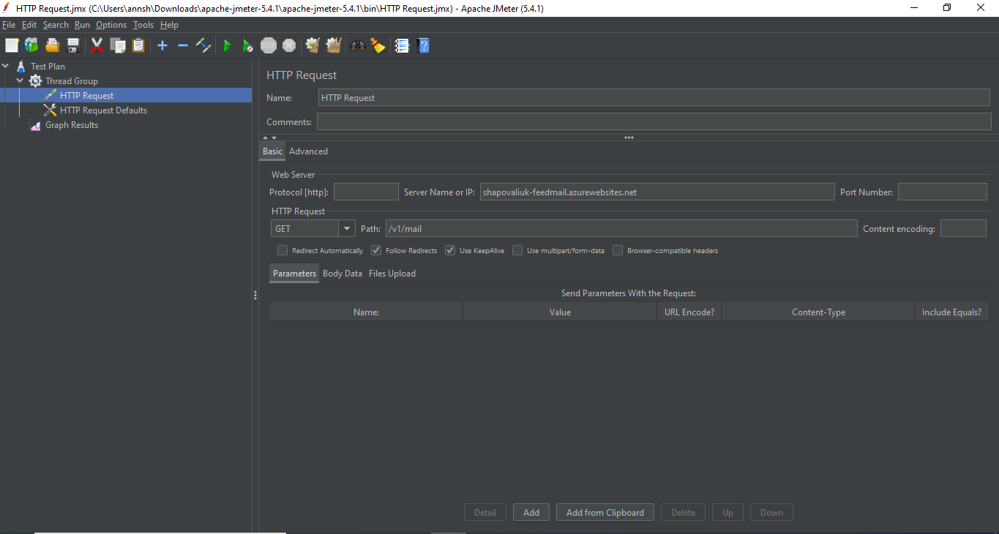

*PostMail*
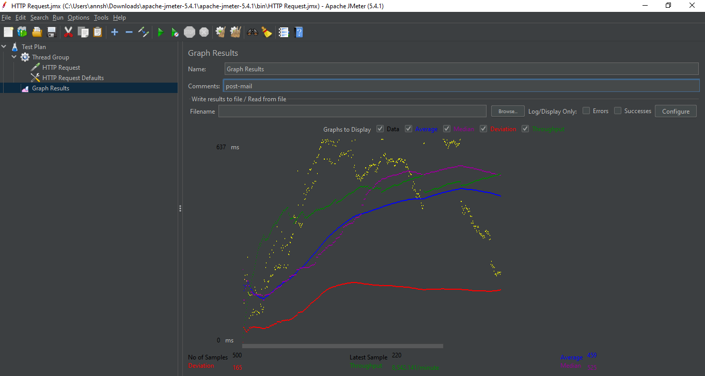
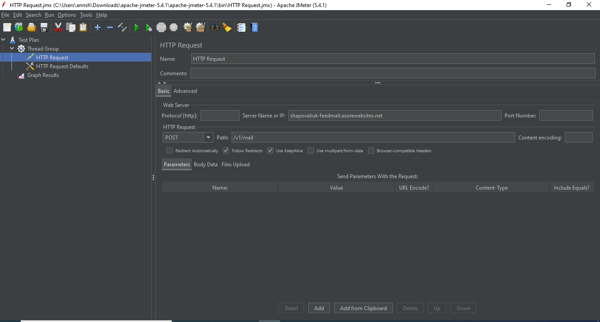
